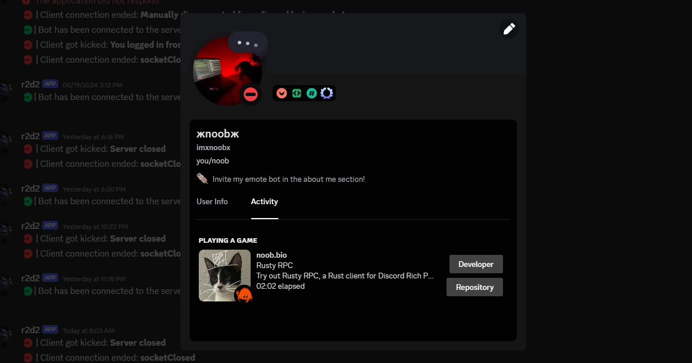

# 🦀 Rusty RPC
> Trying some *rusty* programming language, to make a *rusty discord rpc*. The main goal with this project is to learn Rust and get to know 🦀 **Ferris** and all its secrets.

## 🧶 What is this a Discord RPC
*Discord* RPC (*a.k.a* Discord Rich Presence) is a feature that allows you to display your current activity on *Discord*. It's a way to show what you are doing in a game or application. You can learn more here [*Discord RPC*](https://discord.com/developers/docs/topics/rpc).



This project has been made easier with the help of the wrapper library [*discord-rpc*](https://crates.io/crates/discord-rich-presence) *([git](https://github.com/vionya/discord-rich-presence))* 

# 🪁 How to use
To use this project, you do not need to install anything, just download the latest release from the [releases page](https://github.com/IMXNOOBX/rusty-rpc/releases) and run the executable.

> [!TIP]
> *You can also build it yourself, go to [for developers](#-for-developers)*

## 🧩 Config
To customize your discord rich presence, you can modify the `config.json` file. 

> [!NOTE]  
> *It will prompt you to generate it once you start it*

```json
{
    "client_id": "1164950312914800850", // Developer portal application id

    "state": "Try out Rusty RPC, a Rust client for Discord Rich Presence!", // The subtext
    "details": "Rusty RPC", // The main text
    "timestamp": true, // Show the time elapsed or not

    "images": {
        "large_animated": false, // If you want to show an animated image
        "large_animate_speed": 3000, // The speed of the animation, in milliseconds (not recommended to go below 3000 it causes rate limit issues)
        "large_animated_amount": 12, // The amount of frames in the animation
        "large_animated_img": "catgif", // The prefix of the image, the images should be named like this: catgif0, catgif1, catgif2, etc.

        "large_image": "catto", // The large image, if animated is off
        "large_text": "Im a cat!", // Image description
    
        "small_image": "ferris", // The small image (the one on the bottom right)
        "small_text": "Im a tiny crab!" // Small image description
    },

    "buttons": {
        "first": {
            "label": "Developer", // Button text
            "url": "https://noob.bio" // Button url to open when clicked
        },
        "second": {
            "label": "Repository", // Empty to disable
            "url": "https://github.com/IMXNOOBX/rusty-rpc" // Empty to disable
        }
    }
}
```

## 🚀 For Developers
> [!IMPORTANT]  
> *you need to have Rust installed on your machine. You can install it from [here](https://www.rust-lang.org/tools/install).*

To build the project from source, you can use the following commands:

* Clone the repository
```bash
git clone https://github.com/IMXNOOBX/rusty-rpc
cd rusty-rpc
```
* Run the project
```bash
cargo run
```

* Build the project
```bash
cargo build 
cargo build --release
```


# 🔖 License & Copyright

This project is licensed under [**CC BY-NC 4.0**](https://creativecommons.org/licenses/by-nc/4.0/).
```diff
+ You are free to:
	• Share: Copy and redistribute the material in any medium or format.
	• Adapt: Remix, transform, and build upon the material.
+ Under the following terms:
	• Attribution: You must give appropriate credit, provide a link to original the source repository, and indicate if changes were made.
	• Non-Commercial: You may not use the material for commercial purposes.
- You are not allowed to:
	• Sell: This license forbids selling original or modified material for commercial purposes.
	• Sublicense: This license forbids sublicensing original or modified material.
```
### ©️ Copyright
The content of this project is ©️ by [IMXNOOBX](https://github.com/IMXNOOBX) and the respective contributors. See the [LICENSE.md](LICENSE.md) file for details.